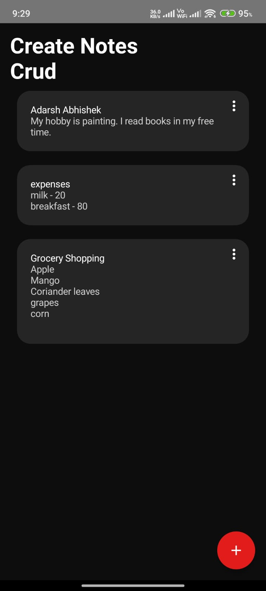

# 📝 Note Making App

A simple and intuitive note-taking Android application designed for quick and organized note management using CRUD (Create, Read, Update & Delete) operations. This app utilizes Firebase for data management and storage.

## 🚀 Features

- Create, read, update, and delete notes seamlessly.
- Real-time synchronization with Firebase.
- User-friendly interface for efficient note management.

## 🛠️ Tech Stack

- Kotlin
- Android Jetpack Components
- Firebase Realtime Database

## 📷 Screenshots

<div style="display: flex; flex-wrap: wrap; justify-content: center; gap: 20px;">

  
  
  
  
  

</div>

## 📦 Installation

1. Clone the repository:
   ```bash
   https://github.com/adarshabhishek/Note_Making_App.git
